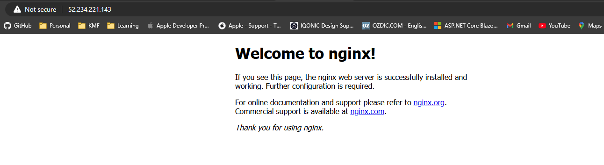

# Azure Infrastructure Operations Project: Deploying a scalable IaaS web server in Azure

### Introduction
For this project, you will write a Packer template and a Terraform template to deploy a customizable, scalable web server in Azure.

### Getting Started
1. Clone this repository

2. Create your infrastructure as code

3. Update this README to reflect how someone would use your code.

### Dependencies
1. Create an [Azure Account](https://portal.azure.com) 
2. Install the [Azure command line interface](https://docs.microsoft.com/en-us/cli/azure/install-azure-cli?view=azure-cli-latest)
3. Install [Packer](https://www.packer.io/downloads)
4. Install [Terraform](https://www.terraform.io/downloads.html)

### Instructions
# 0 Pre-condition
- Login into az, using az login
- Create your own resource group, by command: az group create --name trungnq72-resource-group-project1 --location "East US" --tags environment=production project=myproject
- Create your own princial: az ad sp create-for-rbac --name "myServicePrincipal" --role Contributor --scopes /subscriptions/{subscriptionId}
- Set variables, because i'm using windows, powershell, the commands are:
    $env:ARM_CLIENT_ID="{Princial.appId}"
    $env:ARM_CLIENT_SECRET="{Princial.password}"
    $env:ARM_SUBSCRIPTION_ID="{subscriptionId}"
    $env:ARM_TENANT_ID="{Princial.tenant}"
    $env:ADMIN_USERNAME="{YOUR ACCOUNT}"
    $env:ADMIN_PASSWORD="{YOUR PASSWORD}"

# 1 Create Policy
- Write your own policy. File created: tagging-policy.json

# 2 Create Packer
- Define settings in server.json in folder 'starter_files':
    - OS: Linux Ubuntu 18.04-LTS
    - Services: nginx
    - Size: Standard_DS2_v2
    - Location: East US

- The console:
==> Wait completed after 5 minutes 6 seconds

==> Builds finished. The artifacts of successful builds are:
--> azure-arm: Azure.ResourceManagement.VMImage:

OSType: Linux
ManagedImageResourceGroupName: trungnq72-resource-group-project1
ManagedImageName: trungnq72-image-project1
ManagedImageId: /subscriptions/XXXXXXXXXXXX/resourceGroups/trungnq72-resource-group-project1/providers/Microsoft.Compute/images/trungnq72-image-project1
ManagedImageLocation: East US

- The image:
{
    "name": "trungnq72-image-project1",
    "id": "/subscriptions/XXXXXXXXXXXX/resourceGroups/trungnq72-resource-group-project1/providers/Microsoft.Compute/images/trungnq72-image-project1",
    "type": "Microsoft.Compute/images",
    "location": "eastus",
    "tags": {
        "environment": "production",
        "project": "myproject"
    },
    "properties": {
        "sourceVirtualMachine": {
            "id": "/subscriptions/XXXXXXXXXXXX/resourceGroups/pkr-Resource-Group-p36xhhf2v6/providers/Microsoft.Compute/virtualMachines/pkrvmpXXXXXXhf2v6"
        },
        "storageProfile": {
            "osDisk": {
                "osType": "Linux",
                "osState": "Generalized",
                "diskSizeGB": 30,
                "managedDisk": {
                    "id": "/subscriptions/XXXXXXXXXXXX/resourceGroups/pkr-Resource-Group-p36xhhf2v6/providers/Microsoft.Compute/disks/pkrosXXXXXhf2v6"
                },
                "caching": "ReadWrite",
                "storageAccountType": "Standard_LRS"
            },
            "dataDisks": [],
            "zoneResilient": false
        },
        "provisioningState": "Succeeded",
        "hyperVGeneration": "V1"
    }
}

# 3 Create Packer
- I have 2 files: variables.tf, main.tf
- 1. Run command: terraform init
- 2. in file variables.tf, i setup up some key for my use. example: 
    resource_group_name, location, vnet_name, subnet_name, vm_count, vm_size, admin_username, admin_password, ... 
    With this, we can change to something els without editting the code behind.
- You can change
 vm_count: The number of virtual machine
 admin_username: YOUR OWN ACCOUNT
 admin_password: YOUR OWN PASSWORD

- 3. In file main.tf:
    - I setup up the services that needed:
        azurerm_virtual_network
        azurerm_subnet
        azurerm_network_security_group
        ...

- 4. Remember if you change something in main.tf, you need to run a command again: terraform init , using command: terraform validate for valiating your file before running plan command.

- 5. Run command: terraform plan -out solution.plan
- 6. Run command: terraform apply "solution.plan"
This is the ouput when executing terraform plan -out solution.plan:
Terraform will perform the following actions:

  # azurerm_availability_set.main will be created
  + resource "azurerm_availability_set" "main" {
      + id                           = (known after apply)
      + location                     = "eastus"
      + managed                      = true
      + name                         = "availability"
      + platform_fault_domain_count  = 2
      + platform_update_domain_count = 5
      + resource_group_name          = "trungnq72-resource-group-project1"
    }

  # azurerm_lb.main will be created
  + resource "azurerm_lb" "main" {
      + id                   = (known after apply)
      + location             = "eastus"
      + name                 = "trungnq-load-balancer-project1"
      + private_ip_address   = (known after apply)
      + private_ip_addresses = (known after apply)
      + resource_group_name  = "trungnq72-resource-group-project1"
      + sku                  = "Basic"
      + sku_tier             = "Regional"

      + frontend_ip_configuration {
          + gateway_load_balancer_frontend_ip_configuration_id = (known after apply)
          + id                                                 = (known after apply)
          + inbound_nat_rules                                  = (known after apply)
          + load_balancer_rules                                = (known after apply)
          + name                                               = "LoadBalancerFrontEnd"
          + outbound_rules                                     = (known after apply)
          + private_ip_address                                 = (known after apply)
          + private_ip_address_allocation                      = (known after apply)
          + private_ip_address_version                         = (known after apply)
          + public_ip_address_id                               = (known after apply)
          + public_ip_prefix_id                                = (known after apply)
          + subnet_id                                          = (known after apply)
        }
    }

  # azurerm_lb_backend_address_pool.main will be created
  + resource "azurerm_lb_backend_address_pool" "main" {
      + backend_ip_configurations = (known after apply)
      + id                        = (known after apply)
      + inbound_nat_rules         = (known after apply)
      + load_balancing_rules      = (known after apply)
      + loadbalancer_id           = (known after apply)
      + name                      = "myBackendPool"
      + outbound_rules            = (known after apply)
    }

  # azurerm_lb_probe.main will be created
  + resource "azurerm_lb_probe" "main" {
      + id                  = (known after apply)
      + interval_in_seconds = 5
      + load_balancer_rules = (known after apply)
      + loadbalancer_id     = (known after apply)
      + name                = "myHealthProbe"
      + number_of_probes    = 2
      + port                = 80
      + probe_threshold     = 1
      + protocol            = "Http"
      + request_path        = "/"
    }

  # azurerm_lb_rule.main will be created
  + resource "azurerm_lb_rule" "main" {
      + backend_address_pool_ids       = (known after apply)
      + backend_port                   = 80
      + disable_outbound_snat          = false
      + enable_floating_ip             = false
      + frontend_ip_configuration_id   = (known after apply)
      + frontend_ip_configuration_name = "LoadBalancerFrontEnd"
      + frontend_port                  = 80
      + id                             = (known after apply)
      + idle_timeout_in_minutes        = (known after apply)
      + load_distribution              = (known after apply)
      + loadbalancer_id                = (known after apply)
      + name                           = "myHTTPRule"
      + probe_id                       = (known after apply)
      + protocol                       = "Tcp"
    }

  # azurerm_network_interface.main[0] will be created
  + resource "azurerm_network_interface" "main" {
      + accelerated_networking_enabled = (known after apply)
      + applied_dns_servers            = (known after apply)
      + dns_servers                    = (known after apply)
      + enable_accelerated_networking  = (known after apply)
      + enable_ip_forwarding           = (known after apply)
      + id                             = (known after apply)
      + internal_domain_name_suffix    = (known after apply)
      + ip_forwarding_enabled          = (known after apply)
      + location                       = "eastus"
      + mac_address                    = (known after apply)
      + name                           = "myNIC-0"
      + private_ip_address             = (known after apply)
      + private_ip_addresses           = (known after apply)
      + resource_group_name            = "trungnq72-resource-group-project1"
      + virtual_machine_id             = (known after apply)

      + ip_configuration {
          + gateway_load_balancer_frontend_ip_configuration_id = (known after apply)
          + name                                               = "internal"
          + primary                                            = true
          + private_ip_address                                 = (known after apply)
          + private_ip_address_allocation                      = "Dynamic"
          + private_ip_address_version                         = "IPv4"
          + subnet_id                                          = (known after apply)
        }
    }

  # azurerm_network_interface.main[1] will be created
  + resource "azurerm_network_interface" "main" {
      + accelerated_networking_enabled = (known after apply)
      + applied_dns_servers            = (known after apply)
      + dns_servers                    = (known after apply)
      + enable_accelerated_networking  = (known after apply)
      + enable_ip_forwarding           = (known after apply)
      + id                             = (known after apply)
      + internal_domain_name_suffix    = (known after apply)
      + ip_forwarding_enabled          = (known after apply)
      + location                       = "eastus"
      + mac_address                    = (known after apply)
      + name                           = "myNIC-1"
      + private_ip_address             = (known after apply)
      + private_ip_addresses           = (known after apply)
      + resource_group_name            = "trungnq72-resource-group-project1"
      + virtual_machine_id             = (known after apply)

      + ip_configuration {
          + gateway_load_balancer_frontend_ip_configuration_id = (known after apply)
          + name                                               = "internal"
          + primary                                            = true
          + private_ip_address                                 = (known after apply)
          + private_ip_address_allocation                      = "Dynamic"
          + private_ip_address_version                         = "IPv4"
          + subnet_id                                          = (known after apply)
        }
    }

  # azurerm_network_interface.main[2] will be created
  + resource "azurerm_network_interface" "main" {
      + accelerated_networking_enabled = (known after apply)
      + applied_dns_servers            = (known after apply)
      + dns_servers                    = (known after apply)
      + enable_accelerated_networking  = (known after apply)
      + enable_ip_forwarding           = (known after apply)
      + id                             = (known after apply)
      + internal_domain_name_suffix    = (known after apply)
      + ip_forwarding_enabled          = (known after apply)
      + location                       = "eastus"
      + mac_address                    = (known after apply)
      + name                           = "myNIC-2"
      + private_ip_address             = (known after apply)
      + private_ip_addresses           = (known after apply)
      + resource_group_name            = "trungnq72-resource-group-project1"
      + virtual_machine_id             = (known after apply)

      + ip_configuration {
          + gateway_load_balancer_frontend_ip_configuration_id = (known after apply)
          + name                                               = "internal"
          + primary                                            = true
          + private_ip_address                                 = (known after apply)
          + private_ip_address_allocation                      = "Dynamic"
          + private_ip_address_version                         = "IPv4"
          + subnet_id                                          = (known after apply)
        }
    }

  # azurerm_network_interface_backend_address_pool_association.main[0] will be created
  + resource "azurerm_network_interface_backend_address_pool_association" "main" {
      + backend_address_pool_id = (known after apply)
      + id                      = (known after apply)
      + ip_configuration_name   = "internal"
      + network_interface_id    = (known after apply)
    }

  # azurerm_network_interface_backend_address_pool_association.main[1] will be created
  + resource "azurerm_network_interface_backend_address_pool_association" "main" {
      + backend_address_pool_id = (known after apply)
      + id                      = (known after apply)
      + ip_configuration_name   = "internal"
      + network_interface_id    = (known after apply)
    }

  # azurerm_network_interface_backend_address_pool_association.main[2] will be created
  + resource "azurerm_network_interface_backend_address_pool_association" "main" {
      + backend_address_pool_id = (known after apply)
      + id                      = (known after apply)
      + ip_configuration_name   = "internal"
      + network_interface_id    = (known after apply)
    }

  # azurerm_network_interface_security_group_association.main[0] will be created
  + resource "azurerm_network_interface_security_group_association" "main" {
      + id                        = (known after apply)
      + network_interface_id      = (known after apply)
      + network_security_group_id = (known after apply)
    }

  # azurerm_network_interface_security_group_association.main[1] will be created
  + resource "azurerm_network_interface_security_group_association" "main" {
      + id                        = (known after apply)
      + network_interface_id      = (known after apply)
      + network_security_group_id = (known after apply)
    }

  # azurerm_network_interface_security_group_association.main[2] will be created
  + resource "azurerm_network_interface_security_group_association" "main" {
      + id                        = (known after apply)
      + network_interface_id      = (known after apply)
      + network_security_group_id = (known after apply)
    }

  # azurerm_network_security_group.main will be created
  + resource "azurerm_network_security_group" "main" {
      + id                  = (known after apply)
      + location            = "eastus"
      + name                = "trungnq72-network-sc-project1"
      + resource_group_name = "trungnq72-resource-group-project1"
      + security_rule       = [
          + {
              + access                                     = "Allow"
              + destination_address_prefix                 = "*"
              + destination_address_prefixes               = []
              + destination_application_security_group_ids = []
              + destination_port_range                     = "22"
              + destination_port_ranges                    = []
              + direction                                  = "Inbound"
              + name                                       = "AllowSSH"
              + priority                                   = 1002
              + protocol                                   = "Tcp"
              + source_address_prefix                      = "*"
              + source_address_prefixes                    = []
              + source_application_security_group_ids      = []
              + source_port_range                          = "*"
              + source_port_ranges                         = []
                # (1 unchanged attribute hidden)
            },
          + {
              + access                                     = "Allow"
              + destination_address_prefix                 = "*"
              + destination_address_prefixes               = []
              + destination_application_security_group_ids = []
              + destination_port_range                     = "80"
              + destination_port_ranges                    = []
              + direction                                  = "Inbound"
              + name                                       = "AllowHTTP"
              + priority                                   = 1003
              + protocol                                   = "Tcp"
              + source_address_prefix                      = "*"
              + source_address_prefixes                    = []
              + source_application_security_group_ids      = []
              + source_port_range                          = "*"
              + source_port_ranges                         = []
                # (1 unchanged attribute hidden)
            },
          + {
              + access                                     = "Allow"
              + destination_address_prefix                 = "10.0.1.0/24"
              + destination_address_prefixes               = []
              + destination_application_security_group_ids = []
              + destination_port_range                     = "*"
              + destination_port_ranges                    = []
              + direction                                  = "Inbound"
              + name                                       = "AllowInternal"
              + priority                                   = 1001
              + protocol                                   = "*"
              + source_address_prefix                      = "10.0.1.0/24"
              + source_address_prefixes                    = []
              + source_application_security_group_ids      = []
              + source_port_range                          = "*"
              + source_port_ranges                         = []
                # (1 unchanged attribute hidden)
            },
        ]
    }

  # azurerm_public_ip.main will be created
  + resource "azurerm_public_ip" "main" {
      + allocation_method       = "Static"
      + ddos_protection_mode    = "VirtualNetworkInherited"
      + fqdn                    = (known after apply)
      + id                      = (known after apply)
      + idle_timeout_in_minutes = 4
      + ip_address              = (known after apply)
      + ip_version              = "IPv4"
      + location                = "eastus"
      + name                    = "trungnq72-public-ip-project1"
      + resource_group_name     = "trungnq72-resource-group-project1"
      + sku                     = "Basic"
      + sku_tier                = "Regional"
    }

  # azurerm_resource_group.main will be updated in-place
  ~ resource "azurerm_resource_group" "main" {
        id         = "/subscriptions/5f421d82-b132-4802-85f9-90688eddb963/resourceGroups/trungnq72-resource-group-project1"
        name       = "trungnq72-resource-group-project1"
      ~ tags       = {
          - "environment" = "production" -> null
          - "project"     = "myproject" -> null
        }
        # (2 unchanged attributes hidden)
    }

  # azurerm_subnet.internal will be created
  + resource "azurerm_subnet" "internal" {
      + address_prefixes                               = [
          + "10.0.1.0/24",
        ]
      + default_outbound_access_enabled                = true
      + enforce_private_link_endpoint_network_policies = (known after apply)
      + enforce_private_link_service_network_policies  = (known after apply)
      + id                                             = (known after apply)
      + name                                           = "trungnq72-subnet-project1"
      + private_endpoint_network_policies              = (known after apply)
      + private_endpoint_network_policies_enabled      = (known after apply)
      + private_link_service_network_policies_enabled  = (known after apply)
      + resource_group_name                            = "trungnq72-resource-group-project1"
      + virtual_network_name                           = "trungnq72-vnet"
    }

  # azurerm_subnet_network_security_group_association.main will be created
  + resource "azurerm_subnet_network_security_group_association" "main" {
      + id                        = (known after apply)
      + network_security_group_id = (known after apply)
      + subnet_id                 = (known after apply)
    }

  # azurerm_virtual_machine.main[0] will be created
  + resource "azurerm_virtual_machine" "main" {
      + availability_set_id              = (known after apply)
      + delete_data_disks_on_termination = false
      + delete_os_disk_on_termination    = false
      + id                               = (known after apply)
      + license_type                     = (known after apply)
      + location                         = "eastus"
      + name                             = "myVM-0"
      + network_interface_ids            = (known after apply)
      + resource_group_name              = "trungnq72-resource-group-project1"
      + tags                             = {
          + "environment" = "production"
        }
      + vm_size                          = "Standard_DS2_v2"

      + os_profile {
          # At least one attribute in this block is (or was) sensitive,
          # so its contents will not be displayed.
        }

      + os_profile_linux_config {
          + disable_password_authentication = false
        }

      + storage_data_disk (known after apply)

      + storage_image_reference {
          + id        = "/subscriptions/5f421d82-b132-4802-85f9-90688eddb963/resourceGroups/trungnq72-resource-group-project1/providers/Microsoft.Compute/images/trungnq72-image-project1"
          + version   = (known after apply)
            # (3 unchanged attributes hidden)
        }

      + storage_os_disk {
          + caching                   = "ReadWrite"
          + create_option             = "FromImage"
          + disk_size_gb              = (known after apply)
          + managed_disk_id           = (known after apply)
          + managed_disk_type         = "Standard_LRS"
          + name                      = "myVM-OsDisk-0"
          + os_type                   = (known after apply)
          + write_accelerator_enabled = false
        }
    }

  # azurerm_virtual_machine.main[1] will be created
  + resource "azurerm_virtual_machine" "main" {
      + availability_set_id              = (known after apply)
      + delete_data_disks_on_termination = false
      + delete_os_disk_on_termination    = false
      + id                               = (known after apply)
      + license_type                     = (known after apply)
      + location                         = "eastus"
      + name                             = "myVM-1"
      + network_interface_ids            = (known after apply)
      + resource_group_name              = "trungnq72-resource-group-project1"
      + tags                             = {
          + "environment" = "production"
        }
      + vm_size                          = "Standard_DS2_v2"

      + os_profile {
          # At least one attribute in this block is (or was) sensitive,
          # so its contents will not be displayed.
        }

      + os_profile_linux_config {
          + disable_password_authentication = false
        }

      + storage_data_disk (known after apply)

      + storage_image_reference {
          + id        = "/subscriptions/5f421d82-b132-4802-85f9-90688eddb963/resourceGroups/trungnq72-resource-group-project1/providers/Microsoft.Compute/images/trungnq72-image-project1"
          + version   = (known after apply)
            # (3 unchanged attributes hidden)
        }

      + storage_os_disk {
          + caching                   = "ReadWrite"
          + create_option             = "FromImage"
          + disk_size_gb              = (known after apply)
          + managed_disk_id           = (known after apply)
          + managed_disk_type         = "Standard_LRS"
          + name                      = "myVM-OsDisk-1"
          + os_type                   = (known after apply)
          + write_accelerator_enabled = false
        }
    }

  # azurerm_virtual_machine.main[2] will be created
  + resource "azurerm_virtual_machine" "main" {
      + availability_set_id              = (known after apply)
      + delete_data_disks_on_termination = false
      + delete_os_disk_on_termination    = false
      + id                               = (known after apply)
      + license_type                     = (known after apply)
      + location                         = "eastus"
      + name                             = "myVM-2"
      + network_interface_ids            = (known after apply)
      + resource_group_name              = "trungnq72-resource-group-project1"
      + tags                             = {
          + "environment" = "production"
        }
      + vm_size                          = "Standard_DS2_v2"

      + os_profile {
          # At least one attribute in this block is (or was) sensitive,
          # so its contents will not be displayed.
        }

      + os_profile_linux_config {
          + disable_password_authentication = false
        }

      + storage_data_disk (known after apply)

      + storage_image_reference {
          + id        = "/subscriptions/5f421d82-b132-4802-85f9-90688eddb963/resourceGroups/trungnq72-resource-group-project1/providers/Microsoft.Compute/images/trungnq72-image-project1"
          + version   = (known after apply)
            # (3 unchanged attributes hidden)
        }

      + storage_os_disk {
          + caching                   = "ReadWrite"
          + create_option             = "FromImage"
          + disk_size_gb              = (known after apply)
          + managed_disk_id           = (known after apply)
          + managed_disk_type         = "Standard_LRS"
          + name                      = "myVM-OsDisk-2"
          + os_type                   = (known after apply)
          + write_accelerator_enabled = false
        }
    }

  # azurerm_virtual_network.main will be created
  + resource "azurerm_virtual_network" "main" {
      + address_space       = [
          + "10.0.0.0/16",
        ]
      + dns_servers         = (known after apply)
      + guid                = (known after apply)
      + id                  = (known after apply)
      + location            = "eastus"
      + name                = "trungnq72-vnet"
      + resource_group_name = "trungnq72-resource-group-project1"
      + subnet              = (known after apply)
    }

Plan: 22 to add, 1 to change, 0 to destroy.

Changes to Outputs:
  + loadbalancer_public_ip = (known after apply)

### Output
Terraform will retunr the success:

Apply complete! Resources: 22 added, 1 changed, 0 destroyed.

Outputs:

loadbalancer_public_ip = "23.96.39.63"

Azure web

